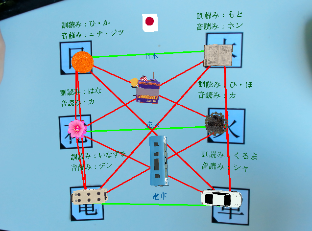
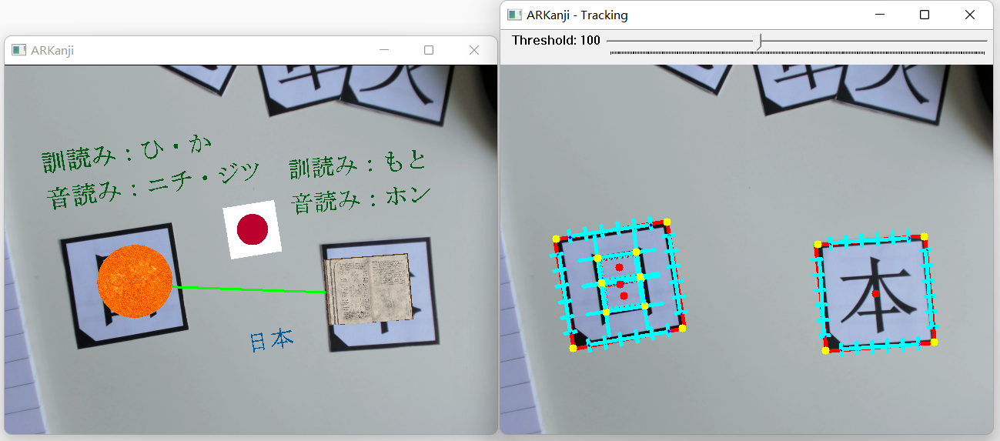
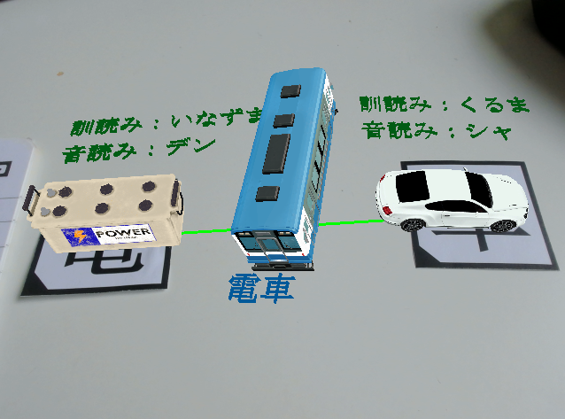
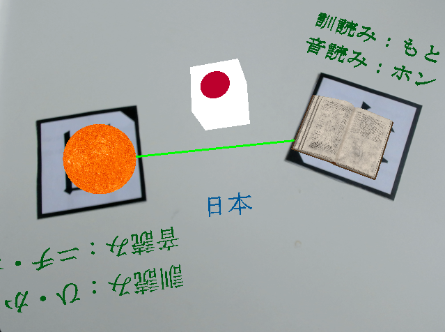
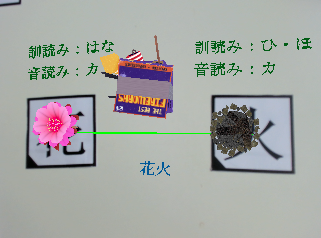

# ARKanji 
[](https://opensource.org/licenses/MIT)

## Introduction 
As a serious AR-game for Japanese or Chinese learners. 
There are a bunch of Kanji-Markers scattered on the table. 
Try different Kanji-combinations to find the meaningful words!

Here is the table of supported kanjis in the demo, you can also find it in [`meta.json`](meta.json).

|       |  花   |  火   |  日   |  本   |  電   |  車   |
| :---: | :---: | :---: | :---: | :---: | :---: | :---: |
| Marker |  | | | | | |
|UTF8| E88AB1 | E781AB| E697A5 | E69CAC | E99BBB | E8BB8A |
|Meaning| Flower | Fire|Sun|Book|Electricity|Car|
|Onyomi| カ |カ |ニチ・ジツ |ホン |デン |シャ |
|Kunyomi|はな |ひ・ほ|ひ・か|もと|いなずま|くるま|

## Pipeline


## Demo
Here are all possible combinations (tangos) presented on the screen.


There is also a OpenCV window for monitoring the marker tracking status for sake of debugging.

|         Meaningful Combination         |           Unmeaningful Combination           |
| :------------------------------------: | :------------------------------------------: |
|  |  |

|            Rotated Marker            |      Normally placed Marker       |
| :----------------------------------: | :-------------------------------: |
|  |  |

**Warning**: The tangos in [meta.json](meta.json) doesn't cover all possible combinations of given monjis. For instance, you may notice that <ins>「日」(sun)</ins> and
<ins>「本」(book)</ins> can be combined as <ins>「<ruby>
  日 <rp>(</rp><rt>に</rt><rp>)</rp>
  本 <rp>(</rp><rt>ほん</rt><rp>)</rp>
</ruby>」(Japan)</ins> or <ins>「<ruby>
  本 <rp>(</rp><rt>ほん</rt><rp>)</rp>
  日 <rp>(</rp><rt>じつ</rt><rp>)</rp>
</ruby>」(Today)</ins>, also <ins>「花」(Flower)</ins> and
<ins>「火」(Fire)</ins> can form <ins>「<ruby>
  花 <rp>(</rp><rt>はな</rt><rp>)</rp>
  火 <rp>(</rp><rt>び</rt><rp>)</rp>
</ruby>」(Firework)</ins> or <ins>「<ruby>
  火 <rp>(</rp><rt>ひ</rt><rp>)</rp>
  花 <rp>(</rp><rt>ばな</rt><rp>)</rp>
</ruby>」(Sparkle)</ins>. In this demo we only consider 「花火」 and 「日本」, the reaason for that it's hard to find some free models to represent sparkle and toady. If you want to get more possible 「単語」(tango) combinations, just edit the [`meta.json`](meta.json) and make sure the corresponding model file also avaliable in [`model`](model/) folder.

## Dependencies 

- [OpenCV](https://opencv.org/) Vision Library
- [GLEW](http://glew.sourceforge.net/) OpenGL API
- [GLFW](https://www.glfw.org/) API for creating OpenGL-Context and window
- [JsonCpp](https://github.com/open-source-parsers/jsoncpp) JSON Parser 
- [Tesseract](https://github.com/tesseract-ocr/tesseract) Optical Character Recognition Library
- [Leptonica](https://github.com/DanBloomberg/leptonica) Image support for Tesseract
- [FTGL](https://github.com/ulrichard/ftgl) Font rendering in OpenGL-Context
- [SOIL2](https://github.com/SpartanJ/SOIL2) For loading 2D textures
- [assimp](https://github.com/assimp/assimp) For loading 3D models

It's recommendable to use vcpkg to manage the libraries, which is a package manager tool just like the pip for Python, maven for Java or npm for JavaScript. It's really convenient to use it to make our lives easier from building a bunch of related dependencies and so on.

**Before Building:** Dont forget to change the path to your vcpkg in [`CmakeLists.txt`](CMakeLists.txt) at ***Line 4***.

## Structure
```
.
├── etc
├── model
├── font
├── shader
├── jpn_tess
├── meta.json
├── build
├── CMakeLists.txt
├── Main.cpp
├── MetaManager.h
├── Model.h
├── Tracker.h
├── ...
└── README.md
```

You may check that [model](model/), [font](font/), [shader](shader/), [jpn_tess](jpn_tess) and [meta.json] are under the directory, they are necessary rescource files for starting the demo. You can use this [document](etc/ARKanji_Markers.docx) to print markers.
## License
[MIT License](./LICENSE)

Copyright (c) 2022 Chang Luo